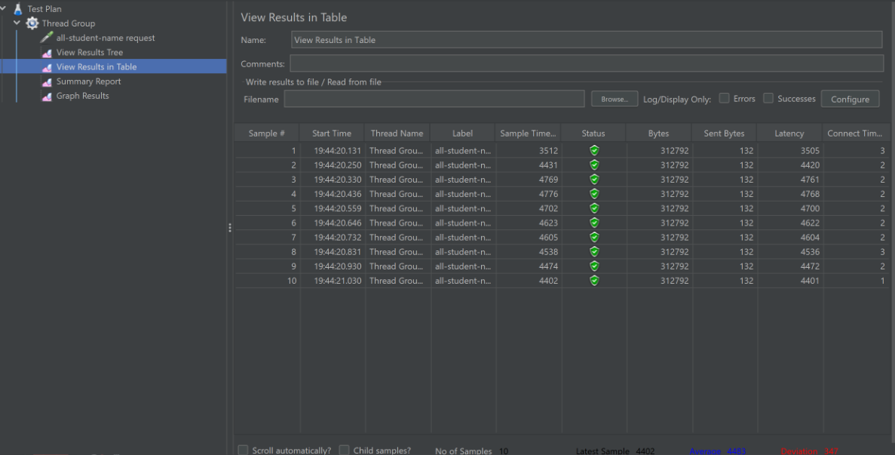

# Module 5: Performance Testing and Profiling

## /all-students

## /all-students-name

## /highest-gpa

1. Difference between JMeter and IntelliJ Profiler:

    - JMeter is primarily used for performance testing, where it simulates a heavy load on the application to measure its performance under stress. It focuses on aspects like response time, throughput, and concurrent user handling.
      IntelliJ Profiler, on the other hand, is used for profiling applications. Profiling involves analyzing the behavior of the application in real-time, examining memory usage, CPU usage, thread execution, method hotspots, etc. This helps in understanding the internal workings of the application and identifying areas for optimization.
2. How profiling helps in identifying weak points:

    - Profiling provides insights into the runtime behavior of the application, pinpointing areas of high resource consumption or inefficiency. By analyzing profiling data, developers can identify bottlenecks, memory leaks, excessive CPU usage, or inefficient algorithms, helping them understand where the application's performance can be improved.
3. Effectiveness of IntelliJ Profiler:

- IntelliJ Profiler is effective in assisting developers to analyze and identify bottlenecks in application code. It offers various profiling modes (e.g., CPU, memory, threads), detailed insights, and visualization tools to understand the application's behavior. However, its effectiveness also depends on the developer's proficiency in interpreting profiling data and understanding application internals.
4. Challenges and overcoming them:

- Challenges in performance testing and profiling include setting up realistic test scenarios, interpreting results accurately, and correlating findings with actual user experience. Overcoming these challenges involves using representative test data, refining test scenarios iteratively, leveraging multiple profiling tools, and collaborating with domain experts for deeper insights.
5. Benefits of using IntelliJ Profiler:

- IntelliJ Profiler offers benefits such as real-time monitoring, detailed insights into application behavior, seamless integration with development environment, and advanced analysis tools. It helps in optimizing application performance, diagnosing issues efficiently, and improving overall code quality.
6. Dealing with inconsistent results:

- Inconsistencies between profiling and performance testing results may occur due to differences in testing methodologies, environments, or instrumentation overhead. It's essential to carefully analyze discrepancies, validate findings across multiple tools, and consider factors like test data, workload distribution, and system configurations to reconcile differences.
7. Optimization strategies and ensuring functionality:

- After analyzing results from performance testing and profiling, optimization strategies may include code refactoring, algorithm optimization, resource management improvements, and caching mechanisms. To ensure changes don't affect functionality, developers should conduct thorough testing, including unit tests, integration tests, and regression tests, to validate the application's behavior under various conditions before deploying changes to production.